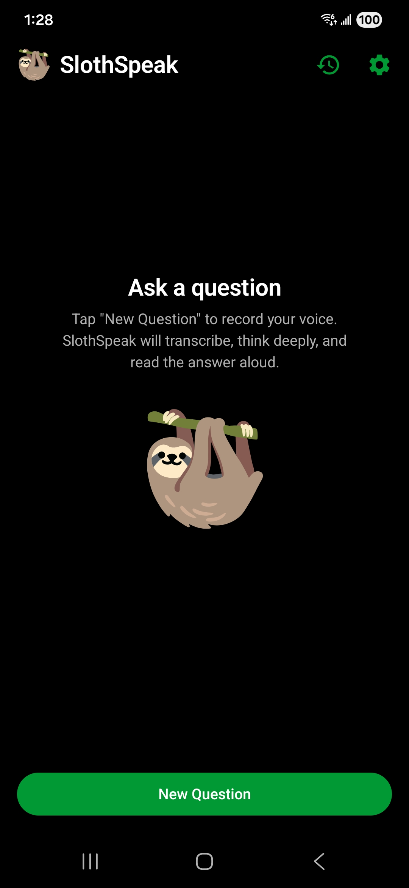
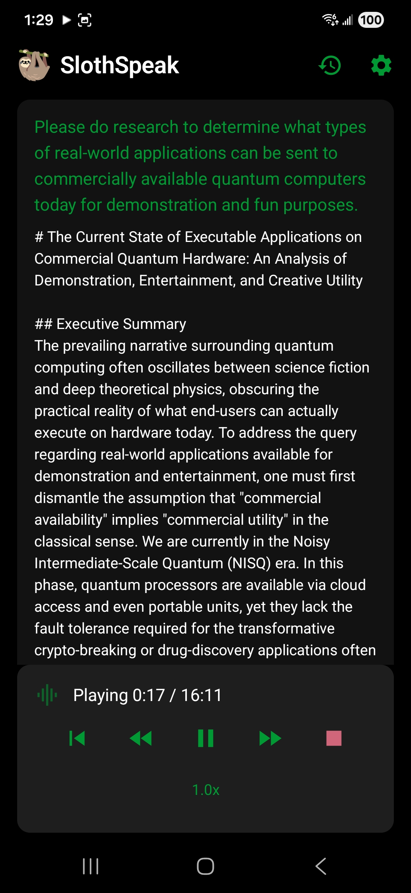
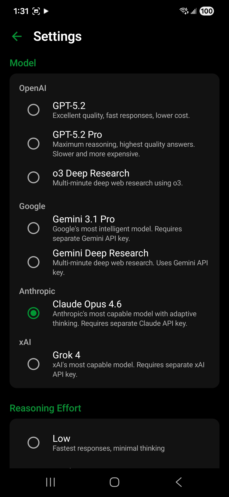
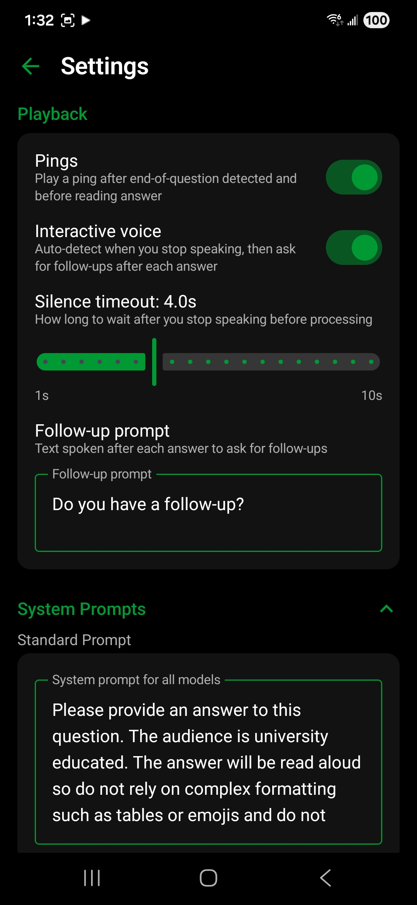

# SlothSpeak

Introducing SlothSpeak: An open-source, bring-your-own-keys, mobile app for voice chat with LLMs that prioritizes response quality over latency.


## Why This Exists

Other voice apps use lighter models optimized for low latency. SlothSpeak makes the opposite trade-off: it uses the most capable AI models at maximum reasoning effort, accepts that responses may take minutes, and delivers the answer as natural-sounding speech. The result is voice-driven access to the highest-quality AI reasoning available, without touching a keyboard.

There is no server backend. The app calls AI provider APIs directly from the device.

<table>
  <tr>
    <td></td>
    <td></td>
  </tr>
  <tr>
    <td></td>
    <td></td>
  </tr>
</table>

## Features

**Multi-provider AI** — Four providers, seven models. Switch between OpenAI GPT-5.2, Gemini 3.1 Pro, Claude Opus 4.6, and Grok 4. GPT-5.2 Pro, Gemini, and Claude support configurable reasoning effort/thinking level.

**Multi-turn conversations** — Ask follow-up questions with full context. OpenAI and Grok chain via `previous_response_id`; Gemini and Claude send explicit conversation history.

**Interactive voice mode** — Hands-free continuous conversation using on-device voice activity detection (Silero VAD). After an answer plays back, the app asks "Do you have a follow-up?" and listens for the next question. Say "no", "I'm done", or stay silent to end the conversation.

**Deep Research** — OpenAI and Gemini deep research models perform extended async research with polling, delivering thorough answers backed by web sources.

**Web search and X search** — Toggle web search for grounded, up-to-date answers (provider-dependent). Grok additionally supports X (Twitter) search.

**Citations** — Responses with citations display numbered footnotes and a sources list. Clean text (without citation markers) is sent to TTS for natural reading.

**13 TTS voices with audio preview** — Choose from alloy, ash, ballad, coral, echo, fable, nova, onyx, sage, shimmer, verse, marin, or cedar. Preview each voice in Settings before selecting.

**Customizable TTS reading style** — Edit the reading style instructions sent to the TTS model (e.g., tone, pacing, emphasis).

**Editable system prompts** — Customize the standard Q&A and deep research system prompts in Settings.

**Playback controls** — Pause/resume, rewind 20s, forward 30s, seek bar across chunks, adjustable speed (0.5x–2.0x).

**Ping and pause** — Optional notification sound and 3-second pause before answer playback begins.

**Audio focus management** — Coexists with other audio apps. Other audio (e.g., Spotify) pauses during recording and playback, then resumes during the thinking/processing phase.

**Conversation history** — Browse past conversations, replay audio, mark favorites, delete conversations, or delete audio only to reclaim storage.

**Retry from failure** — If any pipeline step fails, retry resumes from that step without re-running earlier steps.

**Mute mode** — Mute the current answer to skip playback. The pipeline completes fully (transcription, LLM, TTS, DB save) but audio is not played. The conversation is still saved to history.

**Bluetooth audio** — Automatically routes microphone input through a connected Bluetooth headset for recording. Supports both classic SCO and BLE devices.

**Media session controls** — Headset media buttons and notification transport controls (play, pause, stop) work during answer playback.

**Background processing** — The entire pipeline runs inside an Android foreground service with a wake lock, so it continues even if the user navigates away.

**Encrypted API key storage** — API keys for all four providers are stored with AES-256-GCM encryption via AndroidX Security-Crypto.

**No intermediate server** — The app does not phone home, collect analytics, or transmit telemetry. All API calls go directly from your device to the provider. Your questions and answers are subject to each provider's own data and privacy policies.

## Supported Models

| Provider | Model | ID | Notes |
|----------|-------|----|-------|
| OpenAI | GPT-5.2 Pro | `gpt-5.2-pro` | Configurable reasoning effort (medium/high/xhigh) |
| OpenAI | GPT-5.2 | `gpt-5.2` | Faster, no extended thinking |
| OpenAI | Deep Research | `o3-deep-research` | Async polling, extended web research |
| Google | Gemini 3.1 Pro | `gemini-3.1-pro-preview` | Configurable thinking level (low/medium/high) |
| Google | Gemini Deep Research | `deep-research-pro-preview-12-2025` | Async polling with Google Search |
| Anthropic | Claude Opus 4.6 | `claude-opus-4-6` | Adaptive thinking, effort (low/medium/high/max) |
| xAI | Grok 4 | `grok-4-0709` | Optional web search and X (Twitter) search |

Each provider requires its own API key, configured in Settings. All providers use OpenAI for STT and TTS, so an OpenAI API key is always required.

## Interactive Voice Mode

An optional hands-free conversational mode that enables continuous multi-turn conversations without touching the screen.

When enabled, the app uses **Silero VAD** (Voice Activity Detection) to automatically detect when the user has finished speaking. After the answer plays back, the app asks "Do you have a follow-up?" and listens for the next question. The conversation ends when the user stays silent, says a dismissal phrase ("no", "I'm done", "that's all", etc.), or manually taps "Stop Conversation".

**Audio focus lifecycle in interactive mode:**
1. User presses record — other audio (e.g. Spotify) pauses
2. VAD detects end of speech — ping plays, then other audio resumes during transcription/LLM/TTS
3. Answer playback starts — other audio pauses again
4. Playback finishes — focus held through "Do you have a follow-up?" and mic listening
5. Follow-up speech ends — ping plays, other audio resumes during processing
6. Cycle repeats until conversation ends

**Configurable settings:**
- Silence timeout (1–10 seconds, default 2s): how long to wait after speech stops before processing
- No-speech timeout (8 seconds): how long to wait for any speech before giving up
- Optional ping sound when speech detection triggers

Interactive voice mode is not available for Deep Research models.

## Pipeline

```
Record audio (M4A/AAC or WAV)
    → Upload to POST /v1/audio/transcriptions (gpt-4o-transcribe)
    → Send text to selected provider's LLM API
    → Split answer into ≤4096-char chunks at sentence boundaries
    → POST /v1/audio/speech for all chunks in parallel (gpt-4o-mini-tts, configurable voice)
    → Play MP3 files sequentially with cross-chunk seeking and speed control
    → Save conversation to local database
```

## Tech Stack

| Layer | Technology |
|-------|-----------|
| Language | Kotlin |
| UI | Jetpack Compose + Material 3 |
| HTTP | OkHttp 4 + Retrofit 2 |
| JSON | Moshi |
| Database | Room |
| API key storage | EncryptedSharedPreferences (AES-256) |
| Audio recording | MediaRecorder (M4A/AAC) + AudioRecord (PCM/WAV for VAD) |
| Voice Activity Detection | Silero VAD (android-vad, ONNX Runtime Mobile) |
| Audio playback | MediaPlayer |
| Background work | Foreground Service + Kotlin Coroutines |
| Min SDK | API 26 (Android 8.0) |

## Project Structure

```
app/src/main/java/com/slothspeak/
├── SlothSpeakApplication.kt             Application class, Room DB singleton
├── MainActivity.kt                      Single activity, Compose host, navigation
│
├── api/
│   ├── OpenAIService.kt                 Retrofit interface (OpenAI endpoints)
│   ├── OpenAIClient.kt                  STT, LLM (Responses API + Deep Research), TTS
│   ├── GeminiService.kt                 Retrofit interface (Gemini endpoints)
│   ├── GeminiClient.kt                  Gemini Pro + Deep Research with polling
│   ├── ClaudeService.kt                 Retrofit interface (Claude endpoint)
│   ├── ClaudeClient.kt                  Claude Messages API with adaptive thinking
│   ├── GrokService.kt                   Retrofit interface (Grok endpoint)
│   ├── GrokClient.kt                    Grok Responses API (OpenAI-compatible)
│   └── models/
│       ├── ResponsesRequest.kt          OpenAI LLM request with reasoning config
│       ├── ResponsesResponse.kt         OpenAI LLM response (output extraction)
│       ├── SpeechRequest.kt             TTS request (voice, instructions, format)
│       ├── TranscriptionResponse.kt     STT response
│       ├── ErrorResponse.kt             API error detail
│       ├── GeminiModels.kt              Gemini request/response types
│       ├── ClaudeModels.kt              Claude request/response types
│       └── GrokModels.kt                Grok request/response types
│
├── audio/
│   ├── AudioRecorder.kt                 MediaRecorder wrapper, 5-minute time limit,
│   │                                    countdown via coroutine polling
│   ├── VadAudioRecorder.kt              AudioRecord + Silero VAD for auto end-of-speech
│   │                                    detection. Writes WAV files. Configurable silence
│   │                                    and no-speech timeouts.
│   ├── AudioPlayer.kt                   Sequential MP3 playback, pause/resume/stop,
│   │                                    cross-chunk seeking, adjustable playback speed
│   ├── AudioFocusManager.kt             Audio focus handling, recording and playback modes,
│   │                                    pauses for phone calls and other interruptions
│   ├── BluetoothAudioRouter.kt          Routes mic input to Bluetooth headset (SCO + BLE),
│   │                                    API 31+ setCommunicationDevice / legacy startBluetoothSco
│   └── TtsProcessor.kt                  Parallel chunk TTS (3 concurrent via semaphore)
│
├── config/
│   └── SystemPrompts.kt                 Default system prompts (standard + deep research)
│
├── data/
│   ├── ApiKeyManager.kt                 EncryptedSharedPreferences for API keys (4 providers),
│   │                                    model selection, voice, effort levels, toggles
│   └── db/
│       ├── SlothSpeakDatabase.kt        Room database (singleton)
│       ├── ConversationDao.kt           All queries, including audio path management
│       └── entities/
│           ├── Conversation.kt          Groups Q&A pairs
│           └── QAPair.kt               Question text, answer text, audio file paths,
│                                        response ID, model, effort, timing, rich text
│
├── service/
│   └── SlothSpeakService.kt             Foreground service orchestrating the full pipeline.
│                                        Communicates state via StateFlow (bound service).
│                                        Tracks pipeline step for retry-from-failed-step.
│                                        Holds partial wake lock during processing.
│                                        Manages audio focus and MediaSession.
│                                        Interactive voice mode: follow-up prompt, VAD
│                                        listening, dismissal detection, conversation loop.
│
├── ui/
│   ├── theme/
│   │   ├── Theme.kt                     Dark color scheme (pure black + sky blue)
│   │   ├── Color.kt                     Color constants
│   │   └── Type.kt                      Typography
│   ├── screens/
│   │   ├── MainScreen.kt                Conversation view, New Question / Follow Up buttons,
│   │   │                                permission handling, pipeline status display
│   │   ├── RecordingOverlay.kt          Full-screen overlay with stop button. Manual mode:
│   │   │                                5-minute countdown. Interactive mode: speech
│   │   │                                detection indicator with auto-stop.
│   │   ├── SettingsScreen.kt            API keys (4 providers), model selector with provider
│   │   │                                headings, effort/thinking controls, voice selector
│   │   │                                with preview, web search toggles, system prompts,
│   │   │                                TTS instructions, interactive voice settings,
│   │   │                                storage management
│   │   └── HistoryScreen.kt             Conversation list with date, preview, audio indicator.
│   │                                    Detail view with replay. Delete / delete-audio-only.
│   └── components/
│       ├── QAPairCard.kt                Single Q&A card (question in sky blue, answer in white)
│       ├── StatusIndicator.kt           Animated pipeline step display with cancel/retry,
│       │                                playback controls (seek, speed, pause/resume),
│       │                                interactive mode listening/ending states
│       └── RecordButton.kt              Pulsing stop button for recording overlay
│
├── util/
│   ├── TextChunker.kt                   Splits text at sentence boundaries (max 4096 chars).
│   │                                    Never splits mid-sentence. Falls back to word boundary.
│   ├── CitationFormatter.kt             Extracts URL citations from API responses, produces
│   │                                    clean text (for TTS) and rich text (numbered footnotes
│   │                                    + sources list for display)
│   └── SpeechTextCleaner.kt             Strips markdown formatting from Gemini Deep Research
│                                        output for natural TTS reading
│
└── viewmodel/
    ├── ConversationViewModel.kt          Session state, service binding, recording lifecycle
    │                                     (manual + VAD), follow-up tracking, playback controls,
    │                                     interactive voice audio focus management
    ├── SettingsViewModel.kt              API key CRUD (4 providers), model/voice/effort
    │                                     selection, system prompts, TTS instructions,
    │                                     interactive voice settings, history management
    └── HistoryViewModel.kt               Conversation browsing, audio file resolution
```

## Architecture Decisions

**Separate API clients per provider** — Each AI provider has a different API shape. Each client has its own Retrofit instance with tailored timeouts (LLM: 1500s for deep thinking, STT: 120s, TTS: 180s).

**Foreground service** — The pipeline can take 5+ minutes end-to-end. A foreground service with a persistent notification ensures Android doesn't kill the process. The service holds a partial wake lock (65-minute timeout) to prevent CPU sleep during long LLM calls.

**Parallel TTS** — TTS chunks are independent, so they're sent in parallel (up to 3 concurrent requests via a `Semaphore`). Chunks are played back in order regardless of which finishes first.

**VAD-based end-of-speech detection** — Interactive voice mode uses Silero VAD running on-device. The `VadAudioRecorder` captures raw 16-bit PCM at 16kHz via `AudioRecord`, feeding frames to the VAD model and accumulating WAV output. Uses 512-sample frames (32ms) in `Mode.NORMAL`.

**Audio focus lifecycle** — Recording acquires exclusive transient focus. Focus is released during processing so music can resume. Playback acquires transient focus again. In interactive mode, focus is held through the follow-up prompt and mic listening.

**Sentence-boundary text chunking** — The TTS API has a 4096-character limit. The `TextChunker` walks backward from the limit to find sentence-ending punctuation, preventing mid-sentence cuts.

**Follow-ups via conversation chaining** — OpenAI and Grok pass `previous_response_id`. Gemini and Claude send explicit conversation history.

## Building

Requires Android Studio with SDK 35. Open the project, let Gradle sync, and run on a connected device or use `./gradlew assembleDebug`.

```bash
git clone https://github.com/JonesSteven/SlothSpeak.git
cd SlothSpeak
./gradlew assembleDebug
adb install app/build/outputs/apk/debug/app-debug.apk
```

## Known Limitations

- No transcription preview before the LLM call fires
- TTS retry regenerates all chunks rather than only failed ones
- No progressive playback (must wait for all TTS chunks before audio begins)
- All providers use OpenAI for STT and TTS (requires an OpenAI API key regardless of selected model)

## License

See [LICENSE](LICENSE.md).
